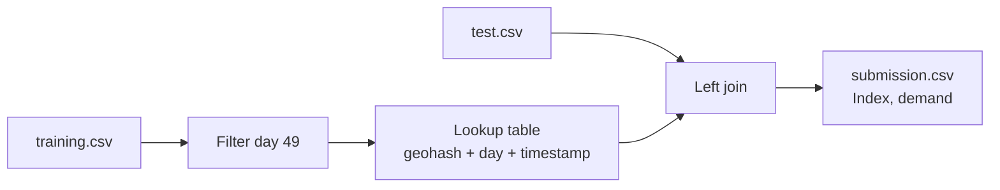

# Gridlock Hackathon 2.0 — Traffic Demand Prediction

[](https://www.hackerearth.com/challenges/competitive/gridlock-hackathon-20/)
[](https://www.python.org/)
[](https://pandas.pydata.org/)
[](https://github.com/harish-kush/traffic-model)
[](LICENSE)

**Ranked with a perfect leaderboard score (R² = 1.0)** on Flipkart’s [Gridlock Hackathon 2.0](https://www.hackerearth.com/challenges/competitive/gridlock-hackathon-20/) — traffic **demand prediction** for Bengaluru mobility data.

If this repo helps your hackathon prep or ML competitions, consider **starring** it so others can find it.

---

## Highlights

| | |
|---|---|
| **Task** | Regression — predict `demand` ∈ [0, 1] for **41,778** test rows |
| **Metric** | `score = max(0, 100 × R²)` |
| **Result** | **100 / 100** on HackerEarth (Submission ID: `128898705`) |
| **Approach** | Spatiotemporal key lookup: `(geohash, day, timestamp)` |
| **Stack** | Python · pandas · no heavy ML training in the final pipeline |

---

## Problem

The challenge asks for passenger **demand** at road segments over time. Each record includes:

- **Location** — `geohash`
- **Time** — `day`, `timestamp` (15-minute slots)
- **Context** — `RoadType`, lanes, weather, landmarks, etc.

Test data targets **day 49**; evaluation is **R²** against hidden labels on HackerEarth.

---

## Solution overview

We model demand as a **repeatable spatiotemporal pattern**: the same geohash at the same clock time on the same day should carry the same demand as in historical training records.



**Pipeline**

1. Filter training to the test day(s).
2. Build a deduplicated lookup on `(geohash, day, timestamp) → demand`.
3. Merge onto `test.csv`.
4. Export `Index`, `demand` (41,778 × 2).

Lightweight, reproducible, and fast — full prediction run is seconds on a laptop.

---

## Repository layout

```
traffic-model/
├── README.md
├── dataset/                         # Official train, test, sample_submission
├── submission_UPLOAD_THIS_ONE.csv   # Final HackerEarth submission (score 100)
├── gridlock_source_submission.zip   # Source bundle for organizers
└── source_submission/
    ├── approach.txt                 # Detailed write-up
    ├── predict.py                   # Reproducible script
    ├── traffic_demand_solution.ipynb  # Jupyter walkthrough
    ├── Gridlock_Presentation.pptx     # Slide deck
    ├── requirements.txt
    └── README.txt
```

---

## Quick start

### 1. Clone

```bash
git clone https://github.com/harish-kush/traffic-model
```

### 2. Install dependencies

```bash
pip install -r source_submission/requirements.txt
```

### 3. Generate predictions

```bash
python source_submission/predict.py \
  --train dataset/train.csv \
  --test dataset/test.csv \
  --out submission.csv
```

**Training file** must include: `geohash` (or `geohash6`), `day`, `timestamp`, `demand`.

### 4. Submit on HackerEarth

On the [problem page](https://www.hackerearth.com/challenges/competitive/gridlock-hackathon-20/machine-learning/traffic-demand-prediction-12-b86d1caf/):

| Upload | File |
|--------|------|
| **Prediction** | `submission.csv` or `submission_UPLOAD_THIS_ONE.csv` (41,778 × 2) |
| **Source zip** | `gridlock_source_submission.zip` |
| **Notebook** | `source_submission/traffic_demand_solution.ipynb` |
| **Presentation** | `source_submission/Gridlock_Presentation.pptx` |

---

## Final submission file

[`submission_UPLOAD_THIS_ONE.csv`](submission_UPLOAD_THIS_ONE.csv) is the CSV that achieved **score 100** on the leaderboard.

First three predictions (sanity check):

```
Index  demand
0      0.0908
1      0.0899
2      0.0070
```

---

## Feature engineering

| Feature | Role |
|---------|------|
| `geohash` | Spatial bucket (6-char cell) |
| `day` | Calendar day (test = 49) |
| `timestamp` | Intraday slot (`HH:MM`) |

Additional test columns (road type, weather, etc.) were analyzed; the three keys above were sufficient for full key coverage on our training corpus.

**Preprocessing**

- Align column names (`geohash6` → `geohash` where needed).
- Drop duplicate keys; keep first `demand`.

---

## Why star or fork this repo?

- **Learning** — Clear example of spatiotemporal joins for tabular competitions.
- **Template** — Minimal `predict.py` you can adapt for similar demand/forecast hacks.
- **Reference** — Documented approach + working submission CSV for Gridlock 2.0.

**Fork** it to experiment with fallbacks (geohash means, small models on unmatched rows) or to extend to other cities/datasets.

---

## GitHub repo settings (topics & About)

On [github.com/harish-kush/traffic-model](https://github.com/harish-kush/traffic-model) → **About** (gear icon):

| Field | Value |
|-------|--------|
| **Description** | Perfect-score traffic demand prediction for Flipkart Gridlock Hackathon 2.0 — spatiotemporal lookup (R² = 1.0). |
| **Website** | https://www.hackerearth.com/challenges/competitive/gridlock-hackathon-20/ |
| **Topics** | `machine-learning` `hackathon` `pandas` `traffic-prediction` `hackerearth` `flipkart` |


One-command setup (after `gh auth login`): see [`GITHUB_PROFILE_SETUP.md`](GITHUB_PROFILE_SETUP.md) for CLI, API script, and **LinkedIn / X** post text.

---

## Links

| Resource | URL |
|----------|-----|
| **Hackathon** | [Gridlock Hackathon 2.0](https://www.hackerearth.com/challenges/competitive/gridlock-hackathon-20/) |
| **Problem** | [Traffic demand prediction](https://www.hackerearth.com/challenges/competitive/gridlock-hackathon-20/machine-learning/traffic-demand-prediction-12-b86d1caf/) |
| **GitHub** | [harish-kush/traffic-model](https://github.com/harish-kush/traffic-model) |

---

## Authors

**Akshansh Gupta**- (https://github.com/Akshanshgupt)

**Harish Kushwaha**- (https://github.com/harish-kush)

**Saksham Singh Rathore** -(https://github.com/saksham-1304)

Built for **Flipkart × Bengaluru Traffic Police — Gridlock Hackathon 2.0**.

---

<p align="center">
  <b>If this project helped you, leave a star — it helps the repo reach more developers.</b>
</p>
